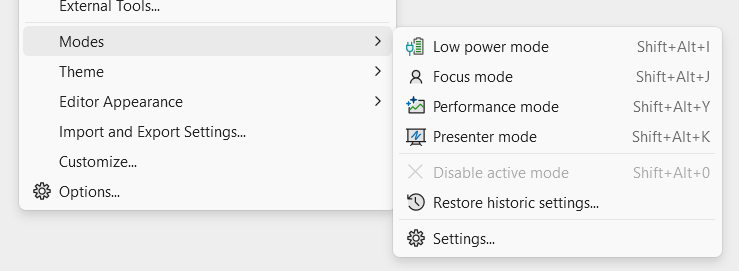
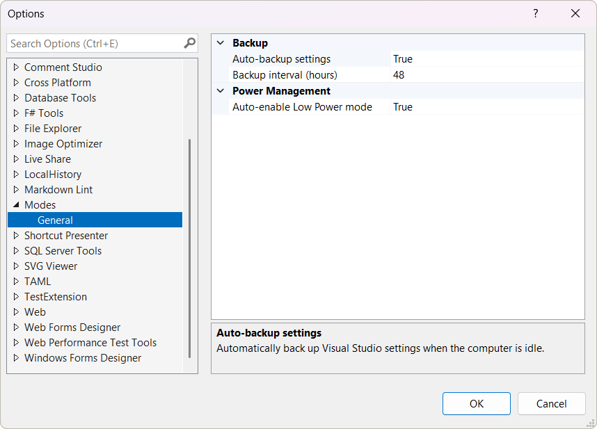
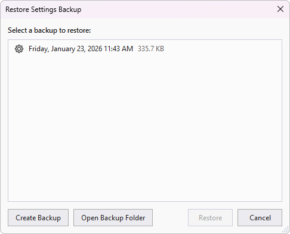

# Visual Studio Modes

**Stop wrestling with Visual Studio settings.** This extension gives you one-click access to optimized configurations for common scenarios - whether you're presenting code, working on battery, need maximum performance, or want distraction-free focus time.

## The Problem

Visual Studio has hundreds of settings that affect performance, battery life, and the coding experience. Finding and tweaking them for different situations is tedious:

- **On battery?** You need to disable CodeLens, background analysis, animations, and more to extend battery life
- **Presenting or screen sharing?** Fonts are too small and the audience can't read your code
- **VS feeling slow?** Figuring out which features to disable requires deep knowledge of the IDE
- **Need to focus?** Tool windows and UI elements constantly compete for attention

Manually toggling these settings every time your context changes is frustrating - and remembering to restore them afterward is even worse.

## The Solution

**Modes** provides four carefully curated configurations that instantly transform Visual Studio for specific scenarios. Enable a mode with one click, and your original settings are automatically backed up. Disable it, and everything is restored exactly as it was.

This extension addresses several popular feature requests from the Visual Studio Developer Community:

- [Focus Mode](https://developercommunity.visualstudio.com/t/Focus-Mode-for-Visual-Studio/1461172)
- [Presentation Mode](https://developercommunity.visualstudio.com/t/Visual-Studio-Presentation-Mode/842920)
- [High battery drain](https://developercommunity.visualstudio.com/t/High-battery-drain/116281)

## Modes

- **🔋 Low Power** - Maximize battery life on laptops
- **🔍 Focus** - Distraction-free coding environment  
- **🚀 Performance** - Eliminate UI lag and typing delays
- **🎤 Presenter** - Large fonts for demos and screen sharing

## Features

- **One-click toggle** from Tools > Modes menu
- **Keyboard shortcuts** - Quick access to all modes
- **Status bar indicator** - see active mode at a glance, click to disable
- **Automatic baseline backup** - your settings are always safe
- **Auto Low Power mode** - activates when Windows enters Energy Saver or on battery
- **Settings backup service** - periodic backups of your VS settings

## Usage

1. Open **Tools > Modes**
2. Click a mode to enable it
3. Click again (or the status bar icon) to disable and restore your settings

### Keyboard Shortcuts

| Shortcut      | Command             |
| ------------- | ------------------- |
| `Shift+Alt+I` | Low Power mode      |
| `Shift+Alt+J` | Focus mode          |
| `Shift+Alt+Y` | Performance mode    |
| `Shift+Alt+K` | Presenter mode      |
| `Shift+Alt+0` | Disable active mode |

## Options

Configure behavior via **Tools > Options > Modes > General**:

| Option                             | Default | Description                                            |
| ---------------------------------- | ------- | ------------------------------------------------------ |
| Auto-backup settings               | true    | Automatically back up Visual Studio settings when idle |
| Auto-enable Low Power mode         | true    | Enable Low Power mode when Windows enters Energy Saver |
| Auto-switch on power source change | false   | Enable Low Power mode when unplugging from AC power    |
| Backup interval (hours)            | 48      | Minimum time between automatic backups                 |

## Restore Settings

Accidentally changed something? Use **Tools > Modes > Restore Settings...** to restore from any previous backup or create a new backup on demand.

## Mode Details

### 🔋 Low Power Mode

*Perfect for: Working on battery, large solutions, limited hardware*

Dramatically reduces CPU, GPU, and disk usage by disabling background work and visual effects. Automatically activates when Windows enters Energy Saver mode (configurable).

| Setting                     | Value          | Why                                     |
| --------------------------- | -------------- | --------------------------------------- |
| Animations                  | Disabled       | Eliminates unnecessary rendering        |
| Auto-downloads              | Disabled       | No background network activity          |
| Background Analysis Scope   | Open documents | Stop analyzing files you're not editing |
| C# Closed File Diagnostics  | Disabled       | No CPU spent on closed files            |
| CodeLens                    | Disabled       | Removes constant background queries     |
| Concurrent Builds           | 1              | Reduces CPU/thermal load                |
| Extension Auto-Update Check | Disabled       | No background network/CPU usage         |
| File Change Detection       | Disabled       | Reduces disk I/O polling                |
| Hardware Acceleration       | Disabled       | Reduces GPU power draw                  |
| Highlight References        | Disabled       | Reduces typing delay                    |
| Inline Hints                | Disabled       | Reduces rendering overhead              |
| Live Unit Testing           | Stopped        | Eliminates continuous test execution    |

### 🔍 Focus Mode

*Perfect for: Deep work, flow state, distraction-free coding*

Creates a minimal, distraction-free environment by hiding UI clutter and reducing visual noise.

| Setting                | Value       | Why                            |
| ---------------------- | ----------- | ------------------------------ |
| Code Fading            | Disabled    | No distracting dimming effects |
| CodeLens               | Disabled    | Cleaner editor                 |
| Current Line Highlight | Disabled    | Cleaner editor appearance      |
| Inline Hints           | Disabled    | Less visual noise              |
| Navigation Bar         | Hidden      | More vertical space            |
| Selection Matches      | Disabled    | No distracting highlights      |
| Tool Windows           | Auto-hidden | Maximum code visibility        |
| Warning Messages       | Disabled    | Fewer interruptions            |

### 🚀 Performance Mode  

*Perfect for: Large solutions, slow machines, eliminating typing lag*

Disables features known to cause UI hangs, typing delays, and slow solution loads.

| Setting                          | Value    | Why                                     |
| -------------------------------- | -------- | --------------------------------------- |
| Concurrent Builds                | 22       | Maximum parallel compilation            |
| Document Restore                 | Disabled | Faster solution open                    |
| Output Window on Build           | Disabled | No UI thread blocking                   |
| Skip Analyzers (implicit builds) | true     | Faster hot reload and background builds |
| Track Active Item                | Disabled | Reduces UI thread work                  |

### 🎤 Presenter Mode

*Perfect for: Presentations, demos, pair programming, screen sharing*

Increases all font sizes so your audience can actually read your code, and disables hover tooltips that can obscure code during demos.

| Setting                 | Value              |
| ----------------------- | ------------------ |
| Command Window          | Cascadia Code 14pt |
| Environment Font        | Segoe UI 11pt      |
| Immediate Window        | Cascadia Code 14pt |
| IntelliSense/Completion | Cascadia Code 14pt |
| Output Window           | Cascadia Code 14pt |
| Printer Font            | Cascadia Code 16pt |
| Quick Info on Hover     | Disabled           |
| Text Editor Font        | Cascadia Code 16pt |
| Watch/Locals Windows    | Cascadia Code 14pt |

## How It Works

1. **Enable a mode** → Your current settings are exported as a baseline backup
2. **Mode settings applied** → The mode's optimized `.vssettings` file is imported
3. **Disable the mode** → Your baseline settings are restored exactly as they were

Modes are mutually exclusive—enabling one automatically disables any other active mode. Your active mode persists across Visual Studio restarts.

## Contributing

Found a bug or have a feature request? Please open an issue on [GitHub](https://github.com/madskristensen/Modes/issues).
